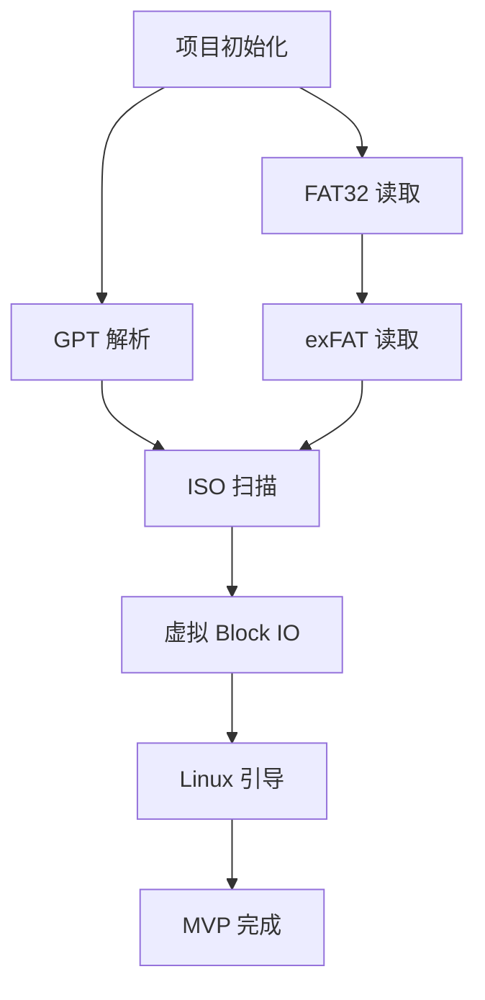

# Multi-Agent 协同规范

## 概述
本文档定义 NextBoot 项目的多 Agent 协同开发方法。每个 Agent 是一个独立的工作单元，专注于特定领域。

## Agent 定义

### 1. Architect (架构师)
**职责**: 整体架构设计、模块划分、技术选型

**触发条件**:
- 新模块设计
- 技术选型决策
- 重构规划

**输出**:
- 架构设计文档 (`docs/architecture.md`)
- 技术决策记录 (`docs/decisions/*.md`)

**示例调用**:
```
启动 architect agent 分析 exFAT 模块设计方案
```

---

### 2. UEFI-Dev (UEFI 核心开发者)
**职责**: UEFI 底层开发、Bootloader 入口、Block IO 操作

**专注模块**:
- `crates/nextboot-boot/`
- `crates/nextboot-virtio/`

**核心任务**:
- [ ] UEFI 入口点实现
- [ ] GPT 分区表读取
- [ ] Block IO Protocol 封装
- [ ] 虚拟 Block IO 驱动

**需求对应**: P0 核心架构

---

### 3. FS-Dev (文件系统开发者)
**职责**: 文件系统实现

**专注模块**:
- `crates/nextboot-fs/`

**核心任务**:
- [ ] FAT32 读取 (ESP 分区)
- [ ] exFAT 读取 (Data 分区)
- [ ] ISO9660 解析 (ISO 镜像内部)

**需求对应**: 模块 A - 文件遍历

---

### 4. GUI-Dev (界面开发者)
**职责**: UEFI GOP 图形界面

**专注模块**:
- `crates/nextboot-menu/`

**核心任务**:
- [ ] GOP 初始化
- [ ] 文本渲染
- [ ] 键盘交互
- [ ] 菜单组件

**需求对应**: 模块 A - 菜单渲染

---

### 5. OS-Dev (操作系统引导开发者)
**职责**: 操作系统启动链

**专注模块**:
- `crates/nextboot-linux/`
- `crates/nextboot-windows/`

**核心任务**:
- Linux: Kernel/Initrd 加载、Cmdline 注入
- Windows: Block IO 劫持、内存补丁

**需求对应**: 模块 C - OS 引导链

---

### 6. Tester (测试工程师)
**职责**: 测试与验证

**核心任务**:
- [ ] QEMU + OVMF 环境搭建
- [ ] 自动化测试脚本
- [ ] 兼容性测试报告

---

## 协同工作流

### Phase 1: MVP 开发流程

```
┌─────────────────────────────────────────────────────────────┐
│                    MVP 开发时间线                            │
├─────────────────────────────────────────────────────────────┤
│                                                             │
│  Week 1-2: 基础设施                                         │
│  ┌─────────┐   ┌─────────┐   ┌─────────┐                   │
│  │Architect│──▶│UEFI-Dev │──▶│ FS-Dev  │                   │
│  │ (设计)  │   │(骨架)   │   │(FAT32)  │                   │
│  └─────────┘   └─────────┘   └─────────┘                   │
│                                                             │
│  Week 3-4: 核心功能                                         │
│  ┌─────────┐   ┌─────────┐   ┌─────────┐                   │
│  │ FS-Dev  │──▶│UEFI-Dev │──▶│OS-Dev   │                   │
│  │(exFAT)  │   │(VirtIO) │   │(Linux)  │                   │
│  └─────────┘   └─────────┘   └─────────┘                   │
│                                                             │
│  Week 5-6: 集成测试                                         │
│  ┌─────────┐   ┌─────────┐                                  │
│  │ GUI-Dev │──▶│ Tester  │                                  │
│  │ (菜单)  │   │ (验证)  │                                  │
│  └─────────┘   └─────────┘                                  │
│                                                             │
└─────────────────────────────────────────────────────────────┘
```

### 任务依赖关系



---

## 通信协议

### 1. 任务状态同步
每个 Agent 在开始/完成任务时，更新 `docs/progress/MVP.md`:

```markdown
## Task: exFAT 读取实现
- **Owner**: fs-dev
- **Status**: IN_PROGRESS
- **Started**: 2026-03-05
- **Dependencies**: FAT32 读取 (DONE)
- **Notes**: 正在实现 exFAT 分区挂载
```

### 2. 接口变更通知
当修改公共 trait 时，在 `docs/changes/` 下创建变更记录:

```markdown
# Change: BlockIO trait 新增方法
- **Date**: 2026-03-05
- **Module**: nextboot-virtio
- **Impact**: nextboot-fs, nextboot-linux
- **Description**: 添加 `read_blocks_aligned()` 方法
```

### 3. 阻塞问题上报
遇到阻塞时，更新任务状态为 `BLOCKED` 并说明原因:

```markdown
## Task: Windows 引导
- **Status**: BLOCKED
- **Blocker**: 需要虚拟 Block IO 驱动完成
- **Waiting On**: uefi-dev (VirtIO task)
```

---

## 决策记录模板 (ADR)

文件: `docs/decisions/NNNN-title.md`

```markdown
# ADR-NNNN: 决策标题

## Status
{Proposed | Accepted | Deprecated | Superseded}

## Context
描述背景和问题

## Decision
描述决策内容

## Consequences
- 正面影响
- 负面影响
- 风险

## Alternatives Considered
- 方案 A
- 方案 B
```

---

## 快速启动指南

### 启动单个 Agent
```
"启动 fs-dev agent 实现 exFAT 读取模块"
```

### 并行多 Agent
```
"并行启动 fs-dev 实现 exFAT，gui-dev 实现菜单原型"
```

### 查看进度
```
"显示当前 MVP 进度"
```

---

## 文件所有权

| 目录/文件 | Owner Agent | 协作者 |
|-----------|-------------|--------|
| `crates/nextboot-boot/` | uefi-dev | architect |
| `crates/nextboot-fs/` | fs-dev | uefi-dev |
| `crates/nextboot-virtio/` | uefi-dev | os-dev |
| `crates/nextboot-menu/` | gui-dev | - |
| `crates/nextboot-linux/` | os-dev | uefi-dev |
| `crates/nextboot-windows/` | os-dev | uefi-dev |
| `docs/architecture.md` | architect | all |
| `docs/progress/*` | all | - |
