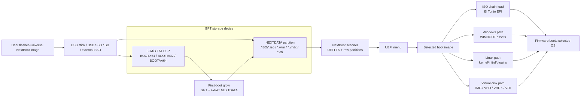

# NextBoot

> Burn once. Drag boot images. Boot anywhere UEFI can see the device.

[简体中文](README.zh-CN.md)

[](https://github.com/tianrking/NextBoot/actions/workflows/ci.yml)
[](https://github.com/tianrking/NextBoot/actions/workflows/full-qemu.yml)
[](https://github.com/tianrking/NextBoot/actions/workflows/real-iso-qemu.yml)
[](https://github.com/tianrking/NextBoot/releases/latest)
[](https://www.rust-lang.org/)
[](#architecture)
[](#compatibility-coverage)
[](#feature-coverage)
[](https://github.com/tianrking/NextBoot/releases/tag/v0.0.3)

NextBoot is a Rust UEFI boot medium for USB sticks, USB SSDs, SD cards, and
fixed-disk style SSD/NVMe deployments. The release artifact is a compressed raw
disk image: users flash it with a normal image writer, open the visible
`NEXTDATA` partition, drag ISO/WIM/VHD/VHDX/IMG/EFI files into `/ISO`, and
choose the device from the firmware UEFI boot menu.

No NextBoot-specific installer, script, or command line is required for end
users.

## Quick Start

1. Download the universal image from the latest GitHub release:
   `nextboot-v0.0.3-universal-uefi.img.xz`.
   If your flashing tool only accepts raw `.img` files, download
   `nextboot-v0.0.3-universal-uefi.img.zip` and extract it.
2. Use a raw-image flasher such as balenaEtcher, Raspberry Pi Imager, Rufus,
   Win32 Disk Imager, or GNOME Disks.
3. Select the NextBoot image, select an 8GB-or-larger USB stick, USB SSD, SD
   card, or external SSD, then flash/write it.
4. Open the visible `NEXTDATA` partition.
5. Drag ISO/WIM/VHD/VHDX/IMG/EFI files into `/ISO`.
6. Boot the device from the firmware UEFI boot menu, then pick an image from
   the NextBoot menu.

Flashing writes a whole-disk image and erases the selected target device. Do
not copy the `.img.xz`, `.img.zip`, or extracted `.img` file into an existing
USB drive; use the flasher's whole-device write mode. If Rufus asks for a mode,
choose DD/raw image mode. On media larger than the release image, NextBoot can
expand `NEXTDATA` on first boot.

## Release Shape

The customer-facing release is a single universal image:

```text
nextboot-v0.0.3-universal-uefi.img.xz
nextboot-v0.0.3-universal-uefi.img.zip
```

Latest release: <https://github.com/tianrking/NextBoot/releases/tag/v0.0.3>

It contains:

| Area | Contents |
| --- | --- |
| GPT | Standard partition table suitable for removable and fixed media |
| ESP | 32MiB FAT ESP with `BOOTX64.EFI`, `BOOTIA32.EFI`, and `BOOTAA64.EFI` |
| Data | Growable exFAT `NEXTDATA` partition with `/ISO` already created |
| Flashing tools | balenaEtcher, Raspberry Pi Imager, Rufus, Win32 Disk Imager, GNOME Disks, and other raw writers |
| Flashing hosts | Windows, macOS, and Linux |
| Boot target | x86_64, IA32, and AArch64 UEFI firmware |
| Workflow | Users drag boot images into `/ISO` and boot from UEFI |

The maintainer build command is:

```bash
./scripts/create-release-media.sh
```

Optional QA builds can preseed images:

```bash
./scripts/create-release-media.sh --image qa-smoke.iso
```

## Supported Images

Drag any supported boot image into `/ISO` on the `NEXTDATA` partition:

- ISO, including generic UEFI ISO, Windows ISO, Linux ISO, and Ventoy-style
  `.vlnk.iso` pointer files
- WIM / ESD containers through the Windows WIMBOOT path
- Raw IMG
- Fixed and dynamic VHD
- VHDX, including sparse, partially-present, and same-volume parent-backed cases
- Dynamic, static, sparse, discarded, and parent-backed VDI
- Standalone EFI executables

## Compatibility Coverage

Automated checks cover both old removable-device layouts and new fixed-disk
style storage:

| Path | Current evidence |
| --- | --- |
| USB 512B FAT32 | QEMU boot smoke reaches `NEXTBOOT_SMOKE_EFI_STARTED` |
| NVMe 4K exFAT | QEMU boot smoke reaches `NEXTBOOT_SMOKE_EFI_STARTED` |
| Real Linux ISOs | QEMU boots Alpine standard to login, Ubuntu Server to installer, and Kali netinst to debian-installer |
| USB SSD 4K layouts | QEMU image matrix covers exFAT, FAT32, NTFS, UDF, ext2/3/4, and Btrfs smoke cases |
| SD-style media | QEMU image/filesystem verification exists; firmware boot behavior still needs real-device evidence |
| Real hardware | Structured report tooling exists, but the public compatibility matrix still needs real pass rows |

Hardware report tooling is tracked in
[`docs/hardware-compatibility-matrix.md`](docs/hardware-compatibility-matrix.md)
for physical USB sticks, USB SSD enclosures, SD readers, motherboard firmware,
and Secure Boot policies.

## Architecture

NextBoot uses a small UEFI loader plus a visible data partition:



At boot, NextBoot scans visible UEFI file systems and raw block-device
partitions, builds a menu, and exposes the selected image as a virtual boot
device. For ISO images it can chain-load EFI El Torito entries or fall back to
Windows and Linux specific paths. For virtual disk images it maps the inner
disk as a bootable virtual block device.

## Feature Coverage

| Area | Status |
| --- | --- |
| GPT split layout | Supported |
| FAT ESP fallback loaders | `BOOTX64.EFI`, `BOOTIA32.EFI`, `BOOTAA64.EFI` |
| Release media growth | Single universal image with first-boot GPT/exFAT expansion |
| Data filesystems | FAT32, exFAT, ext2, ext3, ext4, NTFS, UDF, limited XFS, limited Btrfs |
| Storage buses in QEMU | virtio, NVMe, SATA, USB mass storage, SDHCI SD |
| Sector sizes | 512B and 4K-native style paths where QEMU exposes them |
| Linux ISO plugins | Persistence, injection, DUD, auto-install smoke coverage |
| ISO file replacement | Ventoy-style `conf_replace` virtual ISO overlays |
| Windows ISO | Chain loading plus WIMBOOT fallback assets |
| Virtual disks | Raw IMG, VHD, VHDX, VDI, parent-chain diagnostics and smoke coverage |
| Secure Boot | Local owner-key signing workflow; production public signing is not complete |

## Build

Required tools:

- Rust toolchain from `rust-toolchain.toml`
- UEFI Rust targets as needed
- Python 3 for image generation and verification
- QEMU + OVMF/AAVMF for smoke testing

Common commands:

```bash
# Type-check the default x86_64 UEFI target.
./scripts/build.sh check

# Build the bootloader.
./scripts/build.sh release

# Build all fallback architectures.
TARGET=all ./scripts/build.sh release

# Create a customer-burnable release image.
./scripts/create-release-media.sh
```

The release image is written under:

```text
target/release-media/
```

## Test

CI runs the project health gate, UEFI target checks, QEMU image generation
matrix, and default QEMU boot smoke on every push and pull request.
The scheduled/manual Real ISO QEMU workflow additionally downloads SHA256-pinned
Alpine, Ubuntu Server, and Kali netinst ISOs and boots them through NextBoot.

Useful local checks:

```bash
# Structural, script, release-media, QEMU-image, host-test, and UEFI checks.
./scripts/check-project-health.py

# Default boot smoke: NVMe 4K exFAT, USB 512 FAT32, and SD image verification.
scripts/qemu-smoke-matrix.sh

# Full local matrix when you need the broader compatibility set.
NEXTBOOT_FULL_QEMU_MATRIX=1 scripts/qemu-smoke-matrix.sh

# Real ISO boot checks. Set NEXTBOOT_VENTOY_ASSETS_DIR to a Ventoy asset dir
# when you want to use a local Ventoy checkout instead of the pinned download.
scripts/check-real-iso-qemu.py
```

Direct release-media QA example:

```bash
./scripts/create-smoke-iso.py \
  --profile generic \
  --efi target/x86_64-unknown-uefi/debug/nextboot-smoke-efi.efi \
  --boot-file-name BOOTX64.EFI \
  target/release-media/qa-smoke.iso

./scripts/create-release-media.sh \
  --skip-build \
  --mode debug \
  --image target/release-media/qa-smoke.iso \
  --output target/release-media/nextboot-qa-usb.img
```

## Flash Script

For developers and hardware bring-up, `scripts/flash.sh` writes directly to a
device and can copy boot images during media creation:

```bash
./scripts/build.sh release
./scripts/flash.sh --layout split --data-fs exfat --image /path/to/linux.iso /dev/diskX
```

This is not the preferred end-user flow; public users should receive a release
`.img.xz` and burn it with their normal imaging tool.

## Non-Destructive Update

Existing NextBoot media can be updated without deleting user images. The update
path replaces only the UEFI fallback loaders in the ESP and preserves
`NEXTDATA`, `/ISO`, and user configuration:

```bash
TARGET=all ./scripts/build.sh release
./scripts/update-media.sh /dev/diskX
```

This is the backend for a future user-facing updater. It is intentionally
separate from first-install flashing because flashing a raw image erases the
target device, while updating must not.

## Secure Boot

NextBoot can be signed with a local owner-controlled key:

```bash
./scripts/secure-boot.sh status
./scripts/secure-boot.sh generate-test-cert
./scripts/build.sh release
./scripts/secure-boot.sh sign
./scripts/secure-boot.sh verify
```

This is suitable for personal machines, labs, and firmware where the owner can
enroll a certificate into firmware `db` or shim MOK. Production-grade public
Secure Boot distribution still requires a real shim or Microsoft UEFI CA path,
SBAT/revocation policy, release-key management, and authenticated variable
update handling.

## Repository Layout

```text
crates/
  nextboot-boot/       UEFI bootloader and boot flows
  nextboot-fs/         FAT32, exFAT, ext, NTFS, UDF, XFS, Btrfs, ISO9660 readers
  nextboot-image/      VHDX and VDI metadata/span planning
  nextboot-linux/      Linux boot metadata support
  nextboot-menu/       UEFI menu rendering
  nextboot-virtio/     Virtual block device implementation
  nextboot-windows/    Windows/WIMBOOT helpers

scripts/
  create-release-media.sh   Customer-burnable image builder
  flash.sh                  Developer direct-to-device writer
  run-qemu.sh               Single QEMU scenario runner
  qemu-smoke-matrix.sh      Compatibility smoke matrix
  update-media.sh           Non-destructive ESP bootloader updater
  check-project-health.py   CI health gate

docs/
  release-media.md          Release artifact and user flow
  uefi-product-scope.md     UEFI-only scope, plugins, and update policy
  iso-compatibility-matrix.md
  secure-boot.md            Local Secure Boot signing
  hardware-compatibility-matrix.md
  ventoy-gap-analysis.md
```

## Roadmap

The core release-media flow now exists and is tested through QEMU USB boot.
The product scope is UEFI-only; Legacy BIOS is intentionally out of scope.
The remaining high-value work is:

- build the mainstream ISO compatibility matrix and fix failing real images
- validate non-destructive update on real macOS, Windows, and Linux host flows
- collect real hardware pass rows for USB stick, USB SSD, SD, SATA SSD, NVMe,
  and 4K-sector combinations
- finish production-grade Secure Boot distribution after ISO compatibility is
  proven
- broaden real `mkfs.xfs` and real `mkfs.btrfs` compatibility beyond the
  current limited smoke subsets
- continue expanding virtual-disk recovery and parent-locator repair tooling

## Safety

Writing a raw image to a storage device erases that device. Always verify the
target disk in your imaging tool before burning a NextBoot release image.
