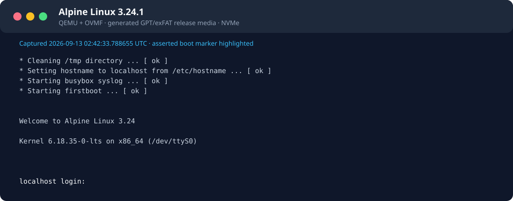
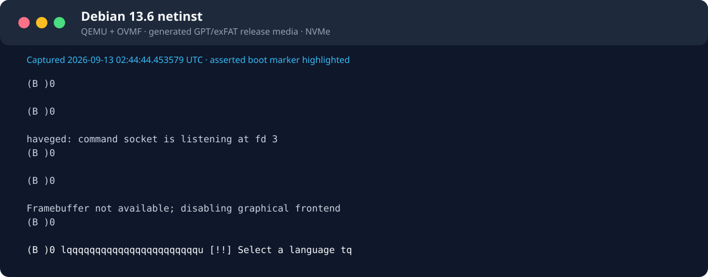
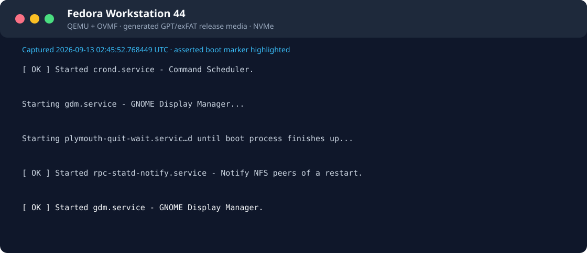
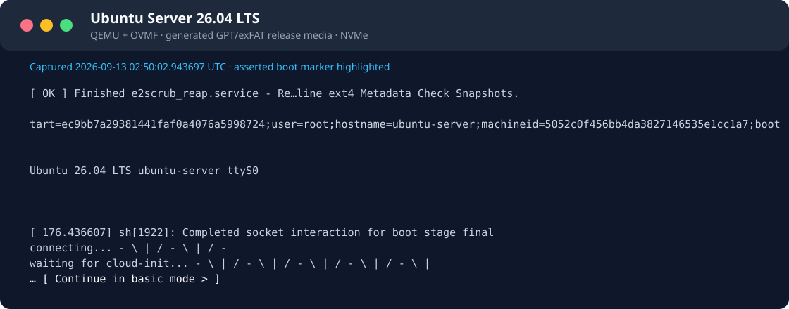
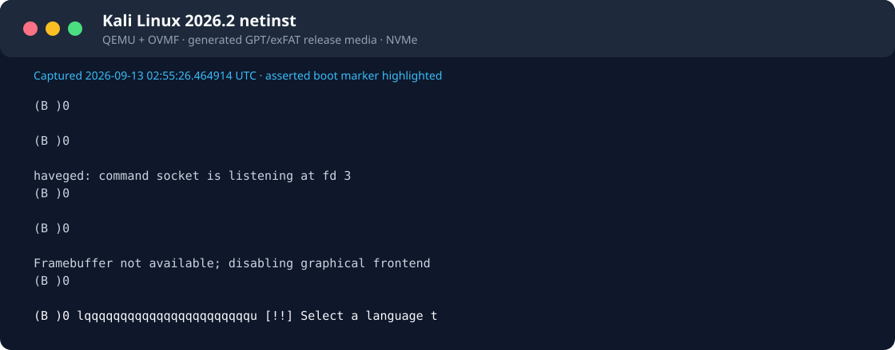
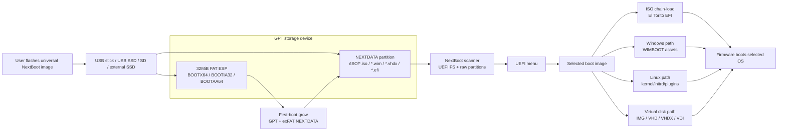

# NextBoot

> UEFI multi-image installation and recovery media, currently being hardened.

[简体中文](README.zh-CN.md)

**Release status:** `v0.1.0-rc.13` is a prerelease. It adds a Windows-native
mount and write/read check for the generated raw image, plus a Windows writer
that verifies every byte after writing. If `NEXTDATA` appears as RAW, the write
did not complete correctly: do not format it; write the image again with the
verified writer below. This is not completed-installation or physical-hardware
certification; see the [release acceptance ledger](docs/release-readiness.md)
before choosing an image for use.

[](https://github.com/tianrking/NextBoot/actions/workflows/ci.yml)
[](https://github.com/tianrking/NextBoot/actions/workflows/full-qemu.yml)
[](https://github.com/tianrking/NextBoot/actions/workflows/real-iso-qemu.yml)
[](https://github.com/tianrking/NextBoot/releases/latest)
[](https://www.rust-lang.org/)
[](#architecture)
[](#compatibility-coverage)
[](#feature-coverage)
[](https://github.com/tianrking/NextBoot/releases/tag/v0.1.0-rc.13)

NextBoot is a Rust UEFI boot medium for USB sticks, USB SSDs, SD cards, and
fixed-disk style SSD/NVMe deployments. The release artifact is a compressed raw
disk image: users flash it with a normal image writer, open the visible
`NEXTDATA` partition, drag ISO/WIM/VHD/VHDX/IMG/EFI files into `/ISO`, and
choose the device from the firmware UEFI boot menu.

The verified Windows path uses the included PowerShell writer. Other raw-image
writers remain usable when their write result is checked before adding boot images.

## Quick Start

1. Download the universal image from the latest GitHub release:
   `nextboot-v0.1.0-rc.13-universal-uefi.img.xz`.
   If your flashing tool only accepts raw `.img` files, download
   `nextboot-v0.1.0-rc.13-universal-uefi.img.zip` and extract it.
2. On Windows, download `nextboot-v0.1.0-rc.13-windows-writer.ps1`, open
   **Administrator PowerShell**, run `Get-Disk` to identify the target disk,
   then run:

   ```powershell
   Unblock-File .\nextboot-v0.1.0-rc.13-windows-writer.ps1
   .\nextboot-v0.1.0-rc.13-windows-writer.ps1 `
     -ImagePath .\nextboot-v0.1.0-rc.13-universal-uefi.img -DiskNumber N
   ```

The writer asks for the disk number one more time, writes the whole image,
then reads the full written range and compares SHA-256 digests. It refuses the
Windows system and boot disks.

After the first UEFI boot, NEXTDATA grows and a whole-image digest is no longer
expected to match. Verify that the immutable EFI loader is still the one from
the release image with the read-only check below:

```powershell
.\nextboot-v0.1.0-rc.13-windows-writer.ps1 `
  -ImagePath .\nextboot-v0.1.0-rc.13-universal-uefi.img -DiskNumber N `
  -VerifyOnly -VerifyBootPartitionOnly
```

This compares only the EFI System Partition, which is unaffected by data
partition growth or the ISO files users add.

To verify both the exact release EFI loader and the ISO you intend to boot in
one read-only check, add the ISO file name. For example, with an SD card at
disk 2 and Omarchy copied to `D:\ISO`:

```powershell
.\nextboot-v0.1.0-rc.13-windows-writer.ps1 `
  -ImagePath .\nextboot-v0.1.0-rc.13-universal-uefi.img -DiskNumber 2 `
  -VerifyOnly -VerifyBootPartitionOnly -ExpectedIsoName omarchy-4.0.3.iso
```

This does not write or reformat the device. It confirms the immutable EFI
partition matches the selected release image, then requires a mounted exFAT
`NEXTDATA` volume containing `ISO\omarchy-4.0.3.iso`.

3. On macOS or Linux, or if choosing another Windows raw-image flasher, select
   the extracted image and an 8GB-or-larger USB stick, USB SSD, SD card, or
   external SSD, then flash/write it.
4. Open the visible `NEXTDATA` partition. Windows must report its filesystem as
   exFAT and it must contain `ISO`. If it is RAW, do not format it; re-write the
   image with the verified Windows writer. For USB card readers and other removable SD/USB media, the writer automatically continues when Windows rejects the optional offline-disk operation; it clears the selected non-system disk after the erase confirmation to release mounted-volume handles, then performs the full raw-image readback check.
5. Drag ISO/WIM/VHD/VHDX/IMG/EFI files into `/ISO`.
6. Boot the device from the firmware UEFI boot menu, then pick an image from
   the NextBoot menu.

### Windows local UEFI preflight

Before restarting a physical machine, QEMU can boot an already-written physical
device through a temporary snapshot:

```powershell
.\scripts\Test-NextBootQemu.ps1 -DiskNumber N -ExpectedImageName your-image.iso
```

Run it from Administrator PowerShell with QEMU for Windows installed at the
default `C:\Program Files\qemu` location. QEMU reads the selected medium but
discards guest writes on exit. The script saves a serial log at
`target\qemu-physical\DiskN.serial.log`. This preflights UEFI startup, menu
discovery, and the requested image listing; it fails if those log markers do
not appear. By default it also attaches two temporary fixed disks, reproducing
the common SD-card-plus-internal-disks topology that exercises the boot-media
scan filter. It does not replace a final boot on the target motherboard firmware.
The startup log and menu include the release tag or local Git build ID, so a
firmware photo can be matched to the exact EFI binary that was written.

Flashing writes a whole-disk image and erases the selected target device. Do
not copy the `.img.xz`, `.img.zip`, or extracted `.img` file into an existing
USB drive; use the flasher's whole-device write mode. If Rufus asks for a mode,
choose DD/raw image mode. On media larger than the release image and no greater
than 128 GiB, NextBoot can expand `NEXTDATA` on first boot.

## Release Shape

The customer-facing release is a single universal image:

```text
nextboot-v0.1.0-rc.13-universal-uefi.img.xz
nextboot-v0.1.0-rc.13-universal-uefi.img.zip
nextboot-v0.1.0-rc.13-windows-writer.ps1
```

Latest release: <https://github.com/tianrking/NextBoot/releases/tag/v0.1.0-rc.13>

It contains:

| Area | Contents |
| --- | --- |
| GPT | Standard partition table suitable for removable and fixed media |
| ESP | 32MiB FAT ESP with `BOOTX64.EFI`, `BOOTIA32.EFI`, and `BOOTAA64.EFI` |
| Data | Growable exFAT `NEXTDATA` partition with `/ISO` already created |
| Windows writer | Included PowerShell writer: full-range SHA-256 post-write verification |
| Other flashing tools | balenaEtcher, Raspberry Pi Imager, Rufus, Win32 Disk Imager, GNOME Disks, and other raw writers |
| Flashing hosts | Windows, macOS, and Linux |
| Boot target | x86_64, IA32, and AArch64 UEFI firmware |
| Workflow | Users drag boot images into `/ISO` and boot from UEFI |

The maintainer build command is:

```bash
./scripts/create-release-media.sh
```

Optional QA builds can preseed images:

```bash
./scripts/create-release-media.sh --image qa-smoke.iso
```

## Supported Images

Drag any supported boot image into `/ISO` on the `NEXTDATA` partition:

- ISO, including generic UEFI ISO, Windows ISO, Linux ISO, and Ventoy-style
  `.vlnk.iso` pointer files
- WIM / ESD containers through the Windows WIMBOOT path
- Raw IMG
- Fixed and dynamic VHD
- VHDX, including sparse, partially-present, and same-volume parent-backed cases
- Dynamic, static, sparse, discarded, and parent-backed VDI
- Standalone EFI executables

## Compatibility Coverage

Automated checks cover both old removable-device layouts and new fixed-disk
style storage:

| Path | Current evidence |
| --- | --- |
| USB 512B FAT32 | QEMU boot smoke reaches `NEXTBOOT_SMOKE_EFI_STARTED` |
| NVMe 4K exFAT | QEMU boot smoke reaches `NEXTBOOT_SMOKE_EFI_STARTED` |
| Real Linux ISOs | Current-branch evidence and pending cases are recorded in the [acceptance ledger](docs/release-readiness.md); test definitions alone are not passes |
| USB SSD 4K layouts | QEMU image matrix covers exFAT, FAT32, NTFS, UDF, ext2/3/4, and Btrfs smoke cases |
| SD-style media | QEMU image/filesystem verification exists; firmware boot behavior still needs real-device evidence |
| Real hardware | Structured report tooling exists, but the public compatibility matrix still needs real pass rows |

## QEMU Release-Media Evidence

The following captures come from the release builder and a fresh `q35` + OVMF
QEMU run with generated GPT/exFAT NVMe media. Each image is rendered from the
serial log only after its matching evidence record reports `pass` and its SHA-256
matches. A boot marker demonstrates that the named ISO reached that milestone;
it does not demonstrate a completed installation, a desktop session, physical
hardware, Windows/WinPE media, Secure Boot, or every release of that distribution.

| ISO image | Asserted boot milestone | QEMU serial-console capture |
| --- | --- | --- |
| Alpine Linux 3.24.1 x64 | Login prompt |  |
| Debian 13.6 netinst x64 | Installer language screen |  |
| Fedora Workstation 44 x64 | GNOME Display Manager service |  |
| Ubuntu Server 26.04 LTS x64 | Serial installer mode selection |  |
| Kali Linux 2026.2 netinst x64 | Installer language screen |  |

Hardware report tooling is tracked in
[`docs/hardware-compatibility-matrix.md`](docs/hardware-compatibility-matrix.md)
for physical USB sticks, USB SSD enclosures, SD readers, motherboard firmware,
and Secure Boot policies.

## Architecture

NextBoot uses a small UEFI loader plus a visible data partition:



At boot, NextBoot scans visible UEFI file systems and raw block-device
partitions, builds a menu, and exposes the selected image as a virtual boot
device. For ISO images it can chain-load EFI El Torito entries or fall back to
Windows and Linux specific paths. For virtual disk images it maps the inner
disk as a bootable virtual block device.

## Feature Coverage

| Area | Status |
| --- | --- |
| GPT split layout | Supported |
| FAT ESP fallback loaders | `BOOTX64.EFI`, `BOOTIA32.EFI`, `BOOTAA64.EFI` |
| Release media growth | Single universal image with first-boot GPT/exFAT expansion |
| Data filesystems | FAT32, exFAT, ext2/3/4, NTFS, UDF readers; limited XFS; Btrfs is a synthetic fixture format, not ordinary mkfs.btrfs support |
| Storage buses in QEMU | virtio, NVMe, SATA, USB mass storage, SDHCI SD |
| Sector sizes | 512B and 4K-native style paths where QEMU exposes them |
| Linux ISO plugins | Persistence, injection, DUD, auto-install smoke coverage |
| ISO file replacement | Ventoy-style `conf_replace` virtual ISO overlays |
| Windows ISO | Chain loading plus WIMBOOT fallback assets |
| Virtual disks | Raw IMG, VHD, VHDX, VDI, parent-chain diagnostics and smoke coverage |
| Secure Boot | Local owner-key signing workflow; production public signing is not complete |

## Build

Required tools:

- Rust toolchain from `rust-toolchain.toml`
- UEFI Rust targets as needed
- Python 3 for image generation and verification
- QEMU + OVMF/AAVMF for smoke testing

Common commands:

```bash
# Type-check the default x86_64 UEFI target.
./scripts/build.sh check

# Build the bootloader.
./scripts/build.sh release

# Build all fallback architectures.
TARGET=all ./scripts/build.sh release

# Create a customer-burnable release image.
./scripts/create-release-media.sh
```

The release image is written under:

```text
target/release-media/
```

## Test

CI runs the project health gate, UEFI target checks, QEMU image generation
matrix, and default QEMU boot smoke on every push and pull request.
The Release Reliability PR workflow runs the full QEMU matrix and downloads
SHA256-pinned Alpine, Ubuntu Server, and Kali netinst ISOs through the same release
builder. Older scheduled full/real-ISO workflows are disabled; their badges must
not be interpreted as fresh evidence.

Useful local checks:

```bash
# Structural, script, release-media, QEMU-image, host-test, and UEFI checks.
./scripts/check-project-health.py

# Default boot smoke: NVMe 4K exFAT, USB 512 FAT32, Linux GRUB, a Windows-shaped
# EFI chain-load image on NVMe 4K UDF, and SD image verification.
scripts/qemu-smoke-matrix.sh

# Full local matrix when you need the broader compatibility set.
NEXTBOOT_FULL_QEMU_MATRIX=1 scripts/qemu-smoke-matrix.sh

# Real ISO boot checks. Set NEXTBOOT_VENTOY_ASSETS_DIR to a Ventoy asset dir
# when you want to use a local Ventoy checkout instead of the pinned download.
scripts/check-real-iso-qemu.py
```

Direct release-media QA example:

```bash
./scripts/create-smoke-iso.py \
  --profile generic \
  --efi target/x86_64-unknown-uefi/debug/nextboot-smoke-efi.efi \
  --boot-file-name BOOTX64.EFI \
  target/release-media/qa-smoke.iso

./scripts/create-release-media.sh \
  --skip-build \
  --mode debug \
  --image target/release-media/qa-smoke.iso \
  --output target/release-media/nextboot-qa-usb.img
```

## Flash Script

For developers and hardware bring-up, `scripts/flash.sh` writes directly to a
device and can copy boot images during media creation:

```bash
./scripts/build.sh release
./scripts/flash.sh --layout split --data-fs exfat --image /path/to/linux.iso /dev/diskX
```

This is not the preferred end-user flow; public users should receive a release
`.img.xz` and burn it with their normal imaging tool.

## Non-Destructive Update

Existing NextBoot media can be updated without deleting user images. The update
path replaces UEFI fallback loaders and the pinned compatibility runtime, and preserves
`/ISO`, user configuration and the partition layout:

```bash
TARGET=all ./scripts/build.sh release
./scripts/update-media.sh /dev/diskX
```

Backups and a recovery journal support automatic failure rollback and explicit
restoration of a previous transaction. See [updating and rollback](docs/update-and-rollback.md)
for Linux/macOS and native Windows usage, recovery commands and validation
limits. Windows selects a disk by stable disk/partition/volume identity and
always refuses the system and boot disks; its current end-to-end evidence uses
a disposable VHD, not a physical USB device.

This is the backend for a future user-facing updater. It is intentionally
separate from first-install flashing because flashing a raw image erases the
target device, while updating must not.

## Secure Boot

NextBoot can be signed with a local owner-controlled key:

```bash
./scripts/secure-boot.sh status
./scripts/secure-boot.sh generate-test-cert
./scripts/build.sh release
./scripts/secure-boot.sh sign
./scripts/secure-boot.sh verify
```

This is suitable for personal machines, labs, and firmware where the owner can
enroll a certificate into firmware `db` or shim MOK. Production-grade public
Secure Boot distribution still requires a real shim or Microsoft UEFI CA path,
SBAT/revocation policy, release-key management, and authenticated variable
update handling.

## Repository Layout

```text
crates/
  nextboot-boot/       UEFI bootloader and boot flows
  nextboot-fs/         FAT32, exFAT, ext, NTFS, UDF, XFS, Btrfs, ISO9660 readers
  nextboot-image/      VHDX and VDI metadata/span planning
  nextboot-linux/      Linux boot metadata support
  nextboot-menu/       UEFI menu rendering
  nextboot-virtio/     Virtual block device implementation
  nextboot-windows/    Windows/WIMBOOT helpers

scripts/
  create-release-media.sh   Customer-burnable image builder
  Write-NextBootMedia.ps1   Windows writer with full post-write verification
  flash.sh                  Developer direct-to-device writer
  run-qemu.sh               Single QEMU scenario runner
  qemu-smoke-matrix.sh      Compatibility smoke matrix
  update-media.sh           Loader/runtime updater with backup and rollback
  check-project-health.py   CI health gate

docs/
  release-media.md          Release artifact and user flow
  uefi-product-scope.md     UEFI-only scope, plugins, and update policy
  iso-compatibility-matrix.md
  secure-boot.md            Local Secure Boot signing
  hardware-compatibility-matrix.md
  ventoy-gap-analysis.md
```

## Roadmap

The core release-media flow now exists and is tested through QEMU USB boot.
The product scope is UEFI-only; Legacy BIOS is intentionally out of scope.
The remaining high-value work is:

- build the mainstream ISO compatibility matrix and fix failing real images
- validate non-destructive update on real macOS, Windows, and Linux host flows
- collect real hardware pass rows for USB stick, USB SSD, SD, SATA SSD, NVMe,
  and 4K-sector combinations
- finish production-grade Secure Boot distribution after ISO compatibility is
  proven
- broaden real `mkfs.xfs` and real `mkfs.btrfs` compatibility beyond the
  current limited smoke subsets
- continue expanding virtual-disk recovery and parent-locator repair tooling

## Safety

Writing a raw image to a storage device erases that device. Always verify the
target disk in your imaging tool before burning a NextBoot release image.


