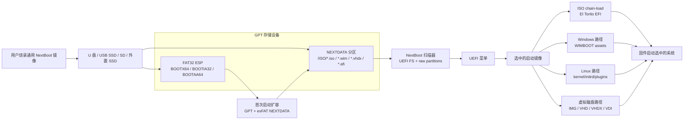

# NextBoot

> 一次烧录。拖入启动镜像。只要固件能看到这块 UEFI 设备，就可以启动。

[English](README.md)

[](https://github.com/tianrking/NextBoot/actions/workflows/ci.yml)
[](https://github.com/tianrking/NextBoot/actions/workflows/full-qemu.yml)
[](https://github.com/tianrking/NextBoot/releases/latest)
[](https://www.rust-lang.org/)
[](#架构)
[](#兼容性覆盖)
[](#功能覆盖)
[](https://github.com/tianrking/NextBoot/releases/tag/v0.0.1)

NextBoot 是一个用 Rust 编写的 UEFI 启动介质项目，面向 U 盘、USB SSD、SD 卡，以及固定磁盘风格的 SSD/NVMe 部署。发布物是一个压缩后的 raw 磁盘镜像：用户用常见烧录工具写入整块设备，打开可见的 `NEXTDATA` 分区，把 ISO/WIM/VHD/VHDX/IMG/EFI 文件拖到 `/ISO`，然后从主板或电脑固件的 UEFI 启动菜单选择这块设备。

终端用户不需要安装 NextBoot 专用脚本、命令行工具或项目特定环境。

## 快速开始

1. 从最新 GitHub Release 下载通用镜像：
   `nextboot-v0.0.1-universal-uefi.img.xz`。
   如果你的烧录工具只接受 raw `.img` 文件，下载
   `nextboot-v0.0.1-universal-uefi.img.zip` 并解压。
2. 使用 balenaEtcher、Raspberry Pi Imager、Rufus、Win32 Disk Imager、GNOME Disks 或其他 raw 镜像写入工具。
3. 选择 NextBoot 镜像，选择 8GB 或更大的 U 盘、USB SSD、SD 卡或外置 SSD，然后执行烧录/写入。
4. 烧录完成后打开可见的 `NEXTDATA` 分区。
5. 把 ISO/WIM/VHD/VHDX/IMG/EFI 文件拖入 `/ISO`。
6. 重启，从固件的 UEFI 启动菜单选择这块设备，然后在 NextBoot 菜单里选择要启动的镜像。

烧录会写入整块磁盘，并清空目标设备上的原有数据。不要把 `.img.xz`、`.img.zip` 或解压后的 `.img` 当普通文件复制到已有 U 盘分区里；必须使用烧录工具的整盘写入模式。如果 Rufus 询问写入模式，选择 DD/raw image mode。对于容量大于发布镜像的设备，NextBoot 可以在首次启动时扩展 `NEXTDATA`。

## 发布形态

面向用户的发布物是一份通用镜像：

```text
nextboot-v0.0.1-universal-uefi.img.xz
nextboot-v0.0.1-universal-uefi.img.zip
```

最新发布：<https://github.com/tianrking/NextBoot/releases/tag/v0.0.1>

它包含：

| 区域 | 内容 |
| --- | --- |
| GPT | 标准 GPT 分区表，适合可移动设备和固定磁盘设备 |
| ESP | FAT32 EFI 系统分区，包含 `BOOTX64.EFI`、`BOOTIA32.EFI`、`BOOTAA64.EFI` |
| Data | 可增长的 exFAT `NEXTDATA` 分区，预置 `/ISO` 目录 |
| 烧录工具 | balenaEtcher、Raspberry Pi Imager、Rufus、Win32 Disk Imager、GNOME Disks 和其他 raw 写入工具 |
| 烧录主机 | Windows、macOS、Linux |
| 启动目标 | x86_64、IA32、AArch64 UEFI 固件 |
| 用户流程 | 用户把启动镜像拖入 `/ISO`，再从 UEFI 启动 |

维护者构建命令：

```bash
./scripts/create-release-media.sh
```

可选的 QA 构建可以预置镜像：

```bash
./scripts/create-release-media.sh --image qa-smoke.iso
```

## 支持的镜像

把支持的启动镜像拖入 `NEXTDATA` 分区里的 `/ISO`：

- ISO，包括通用 UEFI ISO、Windows ISO、Linux ISO，以及 Ventoy 风格的 `.vlnk.iso` 指针文件
- 通过 Windows WIMBOOT 路径启动的 WIM / ESD 容器
- Raw IMG
- 固定和动态 VHD
- VHDX，包括稀疏、部分存在、同卷父镜像支持场景
- 动态、静态、稀疏、discarded 和 parent-backed VDI
- 独立 EFI 可执行文件

## 兼容性覆盖

自动化检查覆盖旧式可移动设备布局和新式固定磁盘风格存储：

| 路径 | 当前证据 |
| --- | --- |
| USB 512B FAT32 | QEMU boot smoke 到达 `NEXTBOOT_SMOKE_EFI_STARTED` |
| NVMe 4K exFAT | QEMU boot smoke 到达 `NEXTBOOT_SMOKE_EFI_STARTED` |
| USB SSD 4K 布局 | QEMU 镜像矩阵覆盖 exFAT、FAT32、NTFS、UDF、ext2/3/4、Btrfs smoke 场景 |
| SD 风格介质 | 已有 QEMU 镜像/文件系统验证；固件启动行为仍需要真实设备证据 |
| 真实硬件 | 已有结构化报告工具，公开兼容矩阵还需要补充真实 pass 行 |

物理 U 盘、USB SSD 盒、SD 读卡器、主板固件和 Secure Boot 策略的硬件报告工具记录在 [`docs/hardware-compatibility-matrix.md`](docs/hardware-compatibility-matrix.md)。

## 架构

NextBoot 由一个小型 UEFI loader 和一个用户可见数据分区组成：



启动时，NextBoot 会扫描可见的 UEFI 文件系统和 raw block-device 分区，构建启动菜单，并把用户选中的镜像暴露成虚拟启动设备。对于 ISO 镜像，它可以 chain-load EFI El Torito entry，或走 Windows / Linux 的特定 fallback 路径。对于虚拟磁盘镜像，它会把内部磁盘映射成可启动的虚拟 block device。

## 功能覆盖

| 区域 | 状态 |
| --- | --- |
| GPT split layout | 支持 |
| FAT32 ESP fallback loaders | `BOOTX64.EFI`、`BOOTIA32.EFI`、`BOOTAA64.EFI` |
| Release media growth | 单一通用镜像，首次启动 GPT/exFAT 扩容 |
| 数据文件系统 | FAT32、exFAT、ext2、ext3、ext4、NTFS、UDF、有限 XFS、有限 Btrfs |
| QEMU 存储总线 | virtio、NVMe、SATA、USB mass storage、SDHCI SD |
| 扇区大小 | 覆盖 QEMU 可暴露的 512B 与 4K-native 风格路径 |
| Linux ISO 插件 | persistence、injection、DUD、auto-install smoke 覆盖 |
| ISO 文件替换 | Ventoy 风格 `conf_replace` 虚拟 ISO overlay |
| Windows ISO | Chain loading 加 WIMBOOT fallback assets |
| 虚拟磁盘 | Raw IMG、VHD、VHDX、VDI、parent-chain 诊断和 smoke 覆盖 |
| Secure Boot | 本地 owner-key 签名流程；面向公众发布的生产级签名尚未完成 |

## 构建

需要的工具：

- `rust-toolchain.toml` 指定的 Rust 工具链
- 按需安装 UEFI Rust targets
- Python 3，用于镜像生成和验证
- QEMU + OVMF/AAVMF，用于 smoke 测试

常用命令：

```bash
# 对默认 x86_64 UEFI target 做类型检查。
./scripts/build.sh check

# 构建 bootloader。
./scripts/build.sh release

# 构建所有 fallback 架构。
TARGET=all ./scripts/build.sh release

# 创建面向用户烧录的 release image。
./scripts/create-release-media.sh
```

发布镜像会写到：

```text
target/release-media/
```

## 测试

CI 会在每次 push 和 pull request 上运行项目健康检查、UEFI target checks、QEMU 镜像生成矩阵，以及默认 QEMU boot smoke。

常用本地检查：

```bash
# 结构、脚本、release media、QEMU image、host test、UEFI checks。
./scripts/check-project-health.py

# 默认 boot smoke：NVMe 4K exFAT、USB 512 FAT32、SD image verification。
scripts/qemu-smoke-matrix.sh

# 需要更大兼容集合时运行完整本地矩阵。
NEXTBOOT_FULL_QEMU_MATRIX=1 scripts/qemu-smoke-matrix.sh
```

直接做 release-media QA 的示例：

```bash
./scripts/create-smoke-iso.py \
  --profile generic \
  --efi target/x86_64-unknown-uefi/debug/nextboot-smoke-efi.efi \
  --boot-file-name BOOTX64.EFI \
  target/release-media/qa-smoke.iso

./scripts/create-release-media.sh \
  --skip-build \
  --mode debug \
  --image target/release-media/qa-smoke.iso \
  --output target/release-media/nextboot-qa-usb.img
```

## 开发者直写脚本

用于开发和硬件 bring-up 时，`scripts/flash.sh` 可以直接写入设备，并在创建介质时复制启动镜像：

```bash
./scripts/build.sh release
./scripts/flash.sh --layout split --data-fs exfat --image /path/to/linux.iso /dev/diskX
```

这不是推荐的终端用户流程；公开用户应该拿到 release `.img.xz`，然后用自己熟悉的镜像烧录工具写入。

## 非破坏性更新

已有 NextBoot 介质可以在不删除用户镜像的情况下更新。更新路径只替换 ESP 里的 UEFI fallback loaders，并保留 `NEXTDATA`、`/ISO` 和用户配置：

```bash
TARGET=all ./scripts/build.sh release
./scripts/update-media.sh /dev/diskX
```

这是未来用户级 updater 的后端。它和第一次安装烧录刻意分开：烧录 raw image 会清空目标设备，而更新不能删除用户数据。

## Secure Boot

NextBoot 可以使用本地、由设备所有者控制的 key 签名：

```bash
./scripts/secure-boot.sh status
./scripts/secure-boot.sh generate-test-cert
./scripts/build.sh release
./scripts/secure-boot.sh sign
./scripts/secure-boot.sh verify
```

这适用于个人机器、实验室，以及所有者可以把证书写入固件 `db` 或 shim MOK 的固件环境。生产级公开 Secure Boot 分发仍需要真实 shim 或 Microsoft UEFI CA 路径、SBAT/revocation 策略、release key 管理和 authenticated variable update 处理。

## 仓库结构

```text
crates/
  nextboot-boot/       UEFI bootloader 和启动流程
  nextboot-fs/         FAT32、exFAT、ext、NTFS、UDF、XFS、Btrfs、ISO9660 readers
  nextboot-image/      VHDX 和 VDI metadata/span planning
  nextboot-linux/      Linux boot metadata support
  nextboot-menu/       UEFI menu rendering
  nextboot-virtio/     Virtual block device implementation
  nextboot-windows/    Windows/WIMBOOT helpers

scripts/
  create-release-media.sh   面向用户的可烧录 image builder
  flash.sh                  开发者 direct-to-device writer
  run-qemu.sh               单个 QEMU 场景 runner
  qemu-smoke-matrix.sh      兼容性 smoke matrix
  update-media.sh           非破坏性 ESP bootloader updater
  check-project-health.py   CI health gate

docs/
  release-media.md          发布物和用户流程
  uefi-product-scope.md     UEFI-only 范围、插件和更新策略
  iso-compatibility-matrix.md
  secure-boot.md            本地 Secure Boot 签名
  hardware-compatibility-matrix.md
  ventoy-gap-analysis.md
```

## 路线图

核心 release-media 流程已经存在，并通过 QEMU USB boot 进行测试。产品范围是 UEFI-only；Legacy BIOS 明确不在范围内。后续高价值工作包括：

- 建立主流 ISO 兼容矩阵，并修复真实镜像失败项
- 在真实 macOS、Windows、Linux 主机流程上验证非破坏性更新
- 收集 U 盘、USB SSD、SD、SATA SSD、NVMe 和 4K-sector 组合的真实硬件 pass 行
- 在 ISO 兼容性证明充分之后，完成生产级 Secure Boot 分发
- 扩展真实 `mkfs.xfs` 和真实 `mkfs.btrfs` 兼容性，超出当前有限 smoke subset
- 继续扩展虚拟磁盘恢复和 parent-locator repair 工具

## 安全提醒

把 raw image 写入存储设备会清空该设备。烧录 NextBoot release image 前，请务必在烧录工具里确认目标磁盘。
